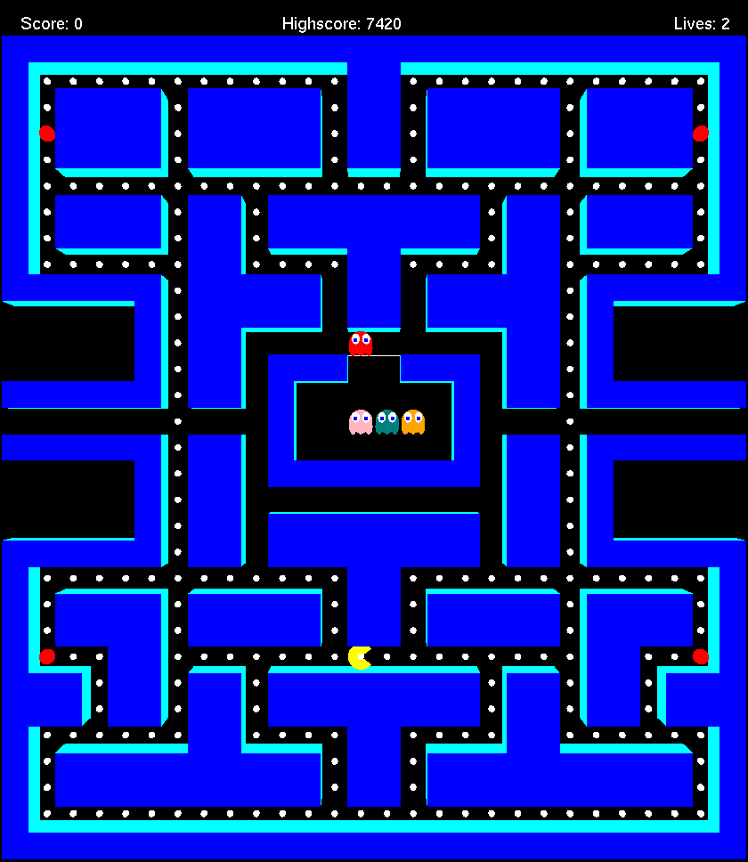

# Pacman

## General info

Pacman game made using C++, OpenGL and FreeGLUT. Ghost AI made using BFS algorithm

## Table of Contents

- [General info](#general-info)
- [Features](#features)
- [Screenshot](#screenshot)
- [Tech stack](#tech-stack)
- [Authors](#authors)

## Features

<li>Player(Pacman) moves using the W, A, S, D keys.

<li>Eat all of the pellets on the map to win the game.

<li>Player has 2 lives.

<li>Highscore stored in a text file.

<li>Blinky(red ghost) goes after Pacman.

<li>Pinky(pink ghost) goes 4 tiles in front of Pacman.

<li>Inky(teal ghost) calculates target tile by using the two tiles infront of pacman, drawing a vector from Blinky's position to that targeted tile and then doubling that vector.

<li>Clyde(orange ghost) goes after Pacman. If Pacman is in a radius of 8 tiles within Clyde, he will target his corner tile instead of Pacman. 

  

## Screenshot

## Tech stack

* C++
* OpenGL
* FreeGLUT

## Authors

| Name          | Github                                   |
|---------------|------------------------------------------|
| Jakov Soldić  | [GitHub](https://github.com/JakovSoldic) |